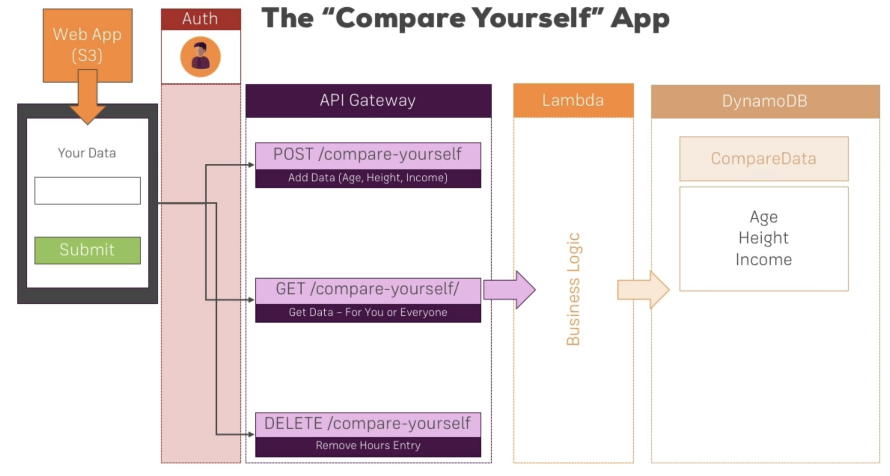
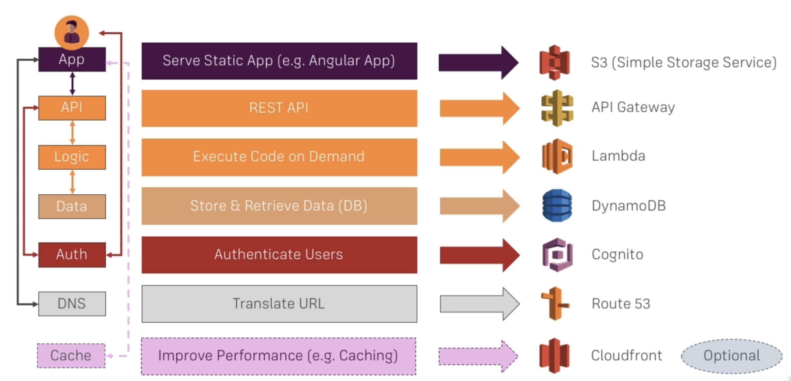

Project 4

Serverless Data Engineering Pipeline

Reproduce the architecture of the example serverless data engineering project or perform something similar using only serverless technologies
Reference Reading: https://github.com/noahgift/awslambda

(Optional) Reference Media: https://learning.oreilly.com/videos/data-engineering-with/9780135964330

Reference Architecture Diagram: https://user-images.githubusercontent.com/58792/55354483-bae7af80-547a-11e9-9909-a5621251065b.png

- AWS Lambda & AWS API Gateway (Business Logic) & AWS Cloudwatch (Monitoring logs)

https://luuopszkbj.execute-api.us-east-1.amazonaws.com/dev
https://luuopszkbj.execute-api.us-east-1.amazonaws.com/dev/compare-yourself