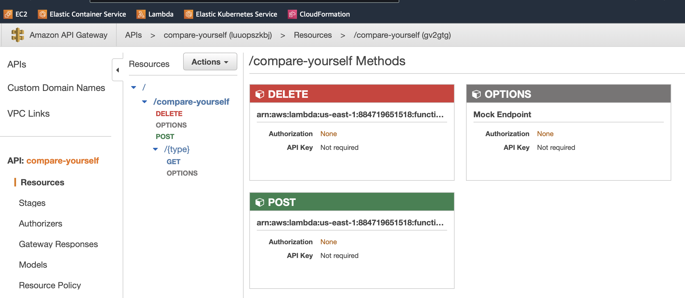
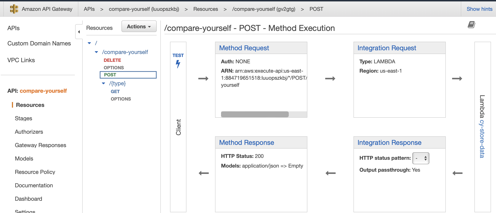
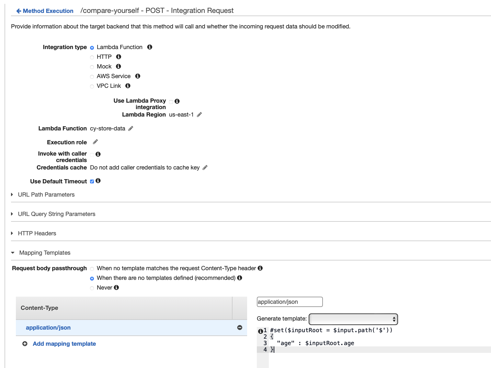
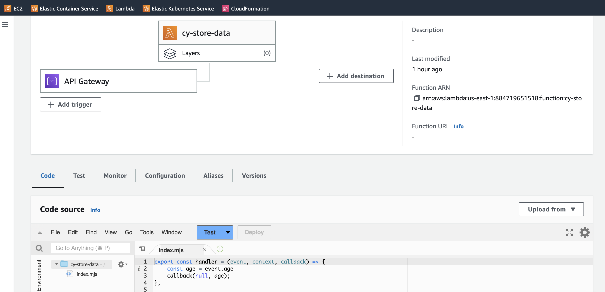
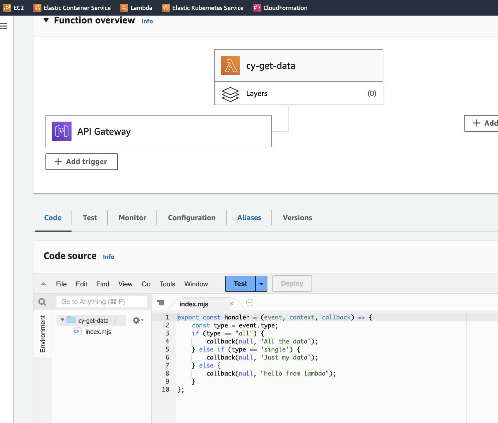
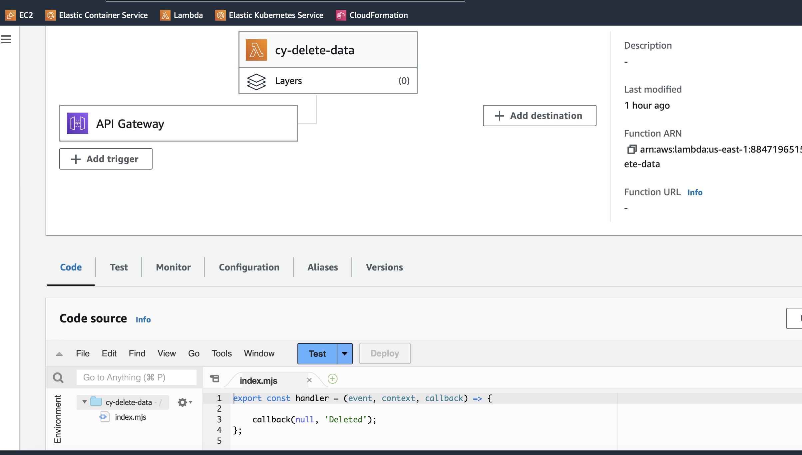

Project 4

Serverless Data Engineering Pipeline

Reproduce the architecture of the example serverless data engineering project or perform something similar using only serverless technologies
Reference Reading: https://github.com/noahgift/awslambda

(Optional) Reference Media: https://learning.oreilly.com/videos/data-engineering-with/9780135964330

Reference Architecture Diagram: https://user-images.githubusercontent.com/58792/55354483-bae7af80-547a-11e9-9909-a5621251065b.png

- AWS Lambda & AWS API Gateway (Business Logic) & AWS Cloudwatch (Monitoring logs)

```javascript
// POST
var xhr = new XMLHttpRequest();
xhr.open('POST', 'https://luuopszkbj.execute-api.us-east-1.amazonaws.com/dev/compare-yourself');
xhr.onreadystatechange = function (event) {
  console.log(event.target.response);
}
xhr.setRequestHeader('Content-Type', 'application/json');
xhr.send(JSON.stringify({age: 26, height: 71, income: 2100}));
```


[](Compare-Yourself-App.png)


[](Architecture.png)


https://luuopszkbj.execute-api.us-east-1.amazonaws.com/dev
https://luuopszkbj.execute-api.us-east-1.amazonaws.com/dev/compare-yourself

AWS API Gateway REST API
[](compare-yourself-Methods.png)

AWS API Gateway Post method execution
add POSTMethod-Execution.pn
[](POSTMethod-Execution.png)

AWS API Gateway Post method integration request
[](POST-IntegrationRequest.png)


AWS Lambda post data method
[](cy-post-store-data.png)

AWS Lambda get data method
[](cy-get-data.png)
    
AWS Lambda delete data method
[](cy-delete-data.png)